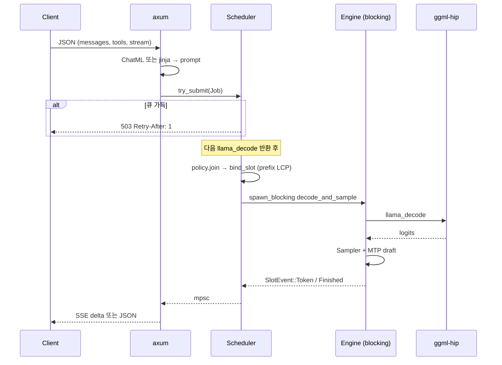

# golbang

> gfx906(AMD MI50)용 GGUF LLM 추론 서버 (서빙 표면은 OpenAI 채팅 API 한 개).
> 서빙·스케줄·배칭은 Rust, GPU 수학은 SHA 고정 `ggml-hip`을 C ABI로 호출한다.

llama-server와 **같은 HIP 커널**을 쓴다. 이기는 지점은 처리량이 아니라
스케줄 정책·취소·즉시 503·경량 제어면이다.

## 목차

- [한 줄](#한-줄)
- [크레이트](#크레이트)
- [요청이 도는 길](#요청이-도는-길)
- [동시성](#동시성)
- [KV와 prefix cache](#kv와-prefix-cache)
- [채팅 표면](#채팅-표면)
- [컴퓨트 FFI](#컴퓨트-ffi)
- [주요 기능](#주요-기능)
- [빌드](#빌드)
- [실행](#실행)
- [설정](#설정)
- [배포](#배포)
- [로드맵](#로드맵)
- [한계](#한계)
- [문서](#문서)
- [라이선스](#라이선스)

## 한 줄

요구는 다섯 가지였다. ① Rust ② GGUF ③ llama.cpp보다 다루기 쉬운 동시성
④ gfx906 ⑤ 단일 바이너리. 순수 Rust GPU 커널은 gfx906에서 검증되지 않아
**하이브리드**로 확정했다 (2026-08-13, ADR `architecture-decision`).

```
┌──────────────────────────────────────────────────────────┐
│  golbang-server  (tokio + axum, 단일 바이너리)            │
│                                                          │
│  HTTP /v1/chat/completions                               │
│    → ChatML 또는 minijinja                               │
│    → bounded 큐 (가득 차면 즉시 503)                     │
│    → Scheduler  (join / evict / chunked prefill)         │
│         │                                                │
│         │  iteration 경계에서만 슬롯 변경                 │
│         ▼                                                │
│  Engine (Mutex<Model>, spawn_blocking)                   │
│    tokenize · llama_decode · sample · MTP · vision       │
│         │  unsafe FFI                                    │
│         ▼                                                │
│  golbang-sys  →  libllama.so + libggml-hip.so (gfx906)   │
└──────────────────────────────────────────────────────────┘
```

- **오케스트레이션 = 100% Rust.** HTTP, 슬롯, 정책, 샘플링, 템플릿, reasoning/tool 파서.
- **GPU 커널 = 검증된 HIP.** Rust가 소유·호출하되 수식은 `ggml-hip`이다.
- **산출물 = 파이썬/Go 없는 한 개의 바이너리.** `.so`는 같은 프로세스에 링크한다.

같은 커널을 Rust로 다시 써도 decode는 안 빨라진다. P6 rocprof에서
DSV4 decode wall의 ~2/3는 `n_cpu_moe=32` CPU expert였다. 상세는
위키 `n-cpu-moe-vram`, `p6-rocprof-notes`.

## 크레이트

워크스페이스 멤버 세 개. unsafe는 `golbang-sys`와 `golbang-core`의 FFI 호출에만 둔다.

| 크레이트 | 역할 | 공개 표면 |
|----------|------|-----------|
| **golbang-server** | axum HTTP, SSE/JSON, `/v1/models`, `/metrics`, API 키 | `golbang-server` 바이너리 |
| **golbang-core** | 스케줄러, 슬롯, 정책, 엔진, 템플릿, 샘플러, prefix, spec, vision, tools | RAII + async API |
| **golbang-sys** | `llama.h` / `mtmd.h` / `llama-ext.h` bindgen + C++ 심볼 심 | C ABI만. safe wrapper 없음 |

```
golbang-server/src
  main.rs      CLI → Model::load → spawn_scheduler → axum::serve
  lib.rs       AppState, ChatRuntime, API 키 미들웨어
  routes.rs    POST /v1/chat/completions, GET /v1/models, GET /models
  sse.rs       템플릿 적용, Job 제출, SSE / 비스트리밍
  types.rs     OpenAI 요청/응답, image_url, tools, reasoning_effort
  metrics.rs   Prometheus 텍스트

golbang-core/src
  scheduler.rs iteration 루프. join/evict는 decode 반환 직후
  policy.rs    SchedulePolicy (지금 FifoPolicy만)
  slot.rs      Empty / Prefilling / Decoding + SlotEvent
  batch.rs     통합 llama_batch. decode 슬롯 먼저, 남는 칸에 prefill
  engine.rs    Mutex<Model>. GPU는 이 락 한 줄
  model.rs     llama_model + context + MTP context + mmproj
  prefix_cache.rs  슬롯 로컬 LCP (크로스 슬롯 복사 없음)
  chat.rs      ChatML 하드코딩 + minijinja
  reasoning.rs <think> → reasoning_content
  tools.rs     DSML / Qwen / Hermes tool_calls
  speculative.rs draft-mtp + ngram-mod
  vision.rs    libmtmd, 마커 <__media__>
  sampler.rs   temperature / top-k / top-p (순수 Rust)

golbang-sys
  build.rs     SHA 핀 검사, gfx906 .so 확인, bindgen
  llama_ext_shim.cpp  MTP nextn 심볼 (C ABI)
```

핀은 `golbang-sys/build.rs`의 `EXPECTED_SHA`가 진실이다.
지금 **`3ac5658c710c0a6f3bf64d3232c4f2f386b6c2ee`**
(`/home/agurrrrr/code/local-llm/llama.cpp-upgrade`, `llama.h` 1629줄).
형제 트리(`llama.cpp`, `.new`, `-furnace`, `-prefetch`)는 HEAD가 다르다. 섞지 않는다.

## 요청이 도는 길

한 건의 `POST /v1/chat/completions`는 대략 이렇게 흐른다.



1. **HTTP** (`routes` → `sse`). `messages`를 검사하고 템플릿을 입힌다.
   `image_url`은 `<__media__>` 마커 + 바이트로 바뀐다.
2. **제출.** `SchedulerHandle::try_submit`은 non-blocking이다.
   큐가 가득이면 핸들러가 decode를 기다리지 않고 503을 낸다.
3. **join.** 빈 슬롯이 있을 때만, **이번 decode가 끝난 뒤** `SchedulePolicy::join`.
4. **bind.** 프롬프트를 토큰화하고 슬롯 prefix와 LCP를 잰다.
   재사용 구간은 prefill하지 않는다. 이미지는 prefix를 쓰지 않고 `mtmd`로 한 번에 eval.
5. **plan.** `BatchBuilder`는 decoding 슬롯을 먼저 넣는다 (`decode_max`는 **슬롯 수**).
   디코드가 있으면 큰 prefill을 같은 `llama_decode`에 넣지 않는다
   (`mixed_prefill_max`, 기본 0 = decode-only). 대신 `prefill_yield_every`마다
   프리필 전용 이터레이션을 넣어 접미가 생성에 굶지 않게 한다. 전부 Prefilling이면
   남은 `n_batch`를 슬롯 수로 나눈다.
6. **GPU.** `spawn_blocking` 한 워커에서 decode → 제자리 샘플 → MTP `process` → draft.
   Qwen3.8 vocab 248k logits를 async 쪽으로 복사하지 않는다.
7. **방출.** `SlotEvent`를 HTTP가 SSE `choices[].delta` 또는 JSON으로 바꾼다.
   `ReasoningParser` / `ToolCallParser`가 태그 단위로 자른다.

취소(`CancellationToken`)와 타임아웃도 **decode 1회가 하한**이다.
llama-server와 같다. decode 도중에 토큰을 끼워 넣지 않는다.

## 동시성

llama-server도 continuous batching이 기본이다. golbang이 다시 만드는 이유는
“CB가 없어서”가 아니다. 스케줄 루프가 `llama_decode`에 묶여 있으면
join/evict/chunk/우선순위를 바꾸기 어렵기 때문이다.

| 장치 | 하는 일 |
|------|---------|
| tokio HTTP | 수신, 503, SSE. GPU를 기다리지 않음 |
| Scheduler 태스크 | 큐 drain, 정책, 배치 계획, 이벤트 전달 |
| `spawn_blocking` | 유일한 HIP 진입. `Engine`의 `Mutex<Model>`이 직렬화 |
| `SchedulePolicy` | `join` / `evict` / `rank` / `budget`. P2는 `fifo`만 |
| `IterationBudget` | `n_parallel==1`이면 `prefill_max=n_batch`, 아니면 `n_ubatch`. `decode_max=n_parallel`. `mixed_prefill_max=0` (디코드와 큰 prefill을 한 `llama_decode`에 안 섞음). `n_parallel>1`이면 `prefill_yield_every=16` / `prefill_yield_max=256`으로 프리필 전용 이터레이션 |

`--n-ctx`는 **슬롯당 기본 몫**이다. 총 KV 풀은 `n_ctx * n_parallel`.
`--n-parallel`은 슬롯 수이자 `llama n_seq_max`이다.
혼자일 때는 `--single-max-ctx`(기본=풀 전체)까지 자란다. 두 번째 슬롯이
붙으면 `min(single_max, max(used, 풀/활성수))`로 다시 나눈다. 이미 쓴
셀은 줄이지 않고, 남은 셀만 신규 슬롯에 준다.

llama 기본은 `kv_unified=false`라 시퀀스마다 독립 스트림이고, 한 슬롯은
`n_ctx_seq ≈ n_ctx`를 넘지 못한다. 스케줄러가 풀 전체를 주려면
`--kv-unified`가 필요하다 (Qwen3.8 생산 유닛).

과부하 계약: bounded mpsc가 가득이면 **즉시** `503` + `Retry-After: 1`.
llama-server는 같은 상황에서 대기할 수 있다. 이건 버그가 아니라 선택이다.

## KV와 prefix cache

P3는 `llama_memory_seq_*` 스파이크 뒤 **슬롯 로컬 재사용**을 골랐다.
P5는 Stop/Length/Cancel 뒤에도 그 KV를 지우지 않는다.

- `SlotPrefixCache`가 직전 프롬프트+생성 토큰을 기억한다.
- 다음 bind에서 LCP만큼 `n_past`, suffix만 `llama_memory_seq_rm`.
- 마지막 프롬프트 토큰 하나는 항상 prefill한다 (logits 셀).
- DSV4는 suffix `seq_rm`이 약해서 prefill 체크포인트 + `--n-rs-seq 1`이 필요하다.
- MTP가 켜지면 `n_rs_seq`를 `--spec-draft-n-max`까지 올린다.
  거부된 draft를 150 MiB state 복사 없이 `seq_rm`하기 위해서다.

`PrefixStore`(슬롯 간 `llama_memory_seq_cp`)는 타입만 있고 **꺼져 있다**.
비전 슬롯은 bind 때 `clear_seq`한다. 이미지 턴은 prefix hit가 없다.

## 채팅 표면

| 경로 | 언제 | 비고 |
|------|------|------|
| Qwen ChatML | 기본. `--jinja` 없거나 jinja 실패 | `<\|im_start\|>` 하드코딩 |
| minijinja | `--jinja` + GGUF `tokenizer.chat_template` 또는 `--chat-template-file` | `llama_chat_apply_template`는 jinja가 아님 |
| reasoning | `--reasoning-format deepseek\|auto` | `<think>` → `reasoning_content`. 시작 태그는 `trim_end()` 후 매칭 |
| `reasoning_effort` | CLI + 요청 필드 | jinja `None`은 `UNDEFINED`로 넘겨야 `default('xhigh')`가 산다 |
| tools | 요청 `tools` | 템플릿에 주입. 출력은 DSML/Qwen/Hermes를 OpenAI `tool_calls`로 |
| vision | `--mmproj` | `image_url` / `input_image`. 마커 `<__media__>` |
| spec | `--spec-type draft-mtp,ngram-mod` | 타깃에서 `[sampled, draft…]` 검증. 불일치·보너스가 다음 pending |

thinking off 템플릿(`<think>\n\n</think>\n\n`)은 content를 유지한다.

## 컴퓨트 FFI

`golbang-sys`는 헤더를 그 자리에서 읽지 않는다. SHA를 검사하고
`llama.h` 줄 수(1629)와 `libggml-hip.so` 안의 `gfx906` 바이트를 확인한 뒤에만 링크한다.

쓰는 C API (현행 이름):

- 로드: `llama_model_load_from_file` / `llama_init_from_model` / `llama_model_free`
- 추론: `llama_decode` / `llama_get_logits` / `llama_memory_seq_*`
- 비전: `mtmd_init_from_file` / `mtmd_helper_bitmap_init_from_buf`
- MTP: `llama_model_n_layer_nextn` + `golbang_llama_*` 심 (`llama-ext.h`)

`--n-cpu-moe N`은 `blk.{0..N-1}.ffn_(up\|down\|gate\|gate_up)_(ch\|)exps`만
CPU buffer에 고정한다. 스레드 수도, 활성 expert 수도 아니다.
32 GiB MI50에 DSV4 IQ2_M(~85 GiB)을 올리려면 `N=32`가 입장료다.

`--no-mmap` → `LLAMA_LOAD_MODE_NONE`. 생산 Qwen 유닛과 같다.

## 주요 기능

- OpenAI `POST /v1/chat/completions` — `stream:true` SSE, `stream:false` JSON
- OpenAI `GET /v1/models` (별칭 `GET /models`) — 로드된 모델 한 개. llama-server와 같은 `meta` 키
- 슬롯 풀 + 교체 가능한 `SchedulePolicy` + chunked prefill
- 다턴 slot-local prefix cache (`cache_n`, timings에 포함)
- Qwen ChatML / GGUF jinja / `--chat-template-file`
- `<think>` reasoning, tool call 파서
- MTP speculative + ngram-mod
- `--mmproj` 비전
- `/metrics` (토큰, TTFT/ITL, draft accept, 503)
- `--prompt-progress` (기본 on): SSE `prompt_progress`로 긴 프리필 동안 연결 유지
- `--api-key` (`Authorization: Bearer` 또는 `X-Api-Key`)
- `--alias` (llama-server `-a`)

없는 것: embeddings, rerank, 크로스 슬롯 prefix 복사, `fifo` 이외 정책,
순수 Rust GPU 커널(P4는 P6 gate 실패로 열지 않음).

## 빌드

**CUDA와 HIP은 각각 빌드한다 — 통합 빌드는 하지 않는다.**
`GOLBANG_GPU` env가 llama.cpp 트리·SHA pin·링크 라이브러리를 결정하고,
`CARGO_TARGET_DIR`으로 타겟 디렉토리를 분리한다. 하나의 바이너리가 두 GPU를
모두 지원하는 단일(통합) 빌드/`--gpu` 런타임 플래그는 **없다** (2026-08-29 결정,
위키 `cuda-hip-separate-builds`).

| GPU | env | 타겟 디렉터리 | llama.cpp 트리 | SHA pin |
|-----|-----|---------------|----------------|---------|
| HIP (MI50 gfx906) | `GOLBANG_GPU=hip` (기본) | `target-hip` | `llama.cpp-upgrade` | `3ac5658c7` |
| CUDA (RTX 3060) | `GOLBANG_GPU=cuda` | `target-cuda` | `llama.cpp-cuda` | `749f688fc` |

서비스는 GPU별 바이너리를 각각 실행한다: MI50 서비스는
`target-hip/release/golbang-server`, RTX 3060 서비스는
`target-cuda/release/golbang-server` (유닛은 `deploy/`).

필요: Rust 1.97+ (`~/.cargo/bin`), ROCm 7.2 (HIP) / CUDA toolkit (CUDA),
핀된 llama.cpp 트리와 그 SHA의 `.so`.

```bash
export PATH="$HOME/.cargo/bin:$PATH"
export GOLBANG_TEST_MODEL=/home/agurrrrr/models/Qwen3-0.6B-Q4_K_M.gguf

# HIP (MI50) 빌드
CARGO_TARGET_DIR=target-hip GOLBANG_GPU=hip cargo build -p golbang-server --release

# CUDA (RTX 3060) 빌드
CARGO_TARGET_DIR=target-cuda GOLBANG_GPU=cuda cargo build -p golbang-server --release

# 테스트 (GOLBANG_GPU로 백엔드 선택, 기본 hip)
CARGO_TARGET_DIR=target-hip GOLBANG_GPU=hip cargo test -p golbang-sys -- --nocapture
```

`cargo test --workspace`는 `GOLBANG_TEST_MODEL`이 있을 때
SSE / JSON / 빈 messages 4xx / decode 중 503까지 돈다.

릴리스 프로필: `lto = "thin"`, `codegen-units = 1`, `opt-level = 3`.

## 실행

기본 포트 **8088** (`:8080` llama-server와 겹치지 않게).

```bash
export PATH="$HOME/.cargo/bin:$PATH"

# 소형 스모크
cargo run -p golbang-server --release -- \
  --model "$GOLBANG_TEST_MODEL" --port 8088 \
  --n-parallel 2 --queue-size 2 --policy fifo

# 스트리밍
curl -N -X POST http://127.0.0.1:8088/v1/chat/completions \
  -H 'Content-Type: application/json' \
  -d '{"model":"qwen","messages":[{"role":"user","content":"안녕"}],"stream":true,"max_tokens":32}'

# 비스트리밍
curl -sS -X POST http://127.0.0.1:8088/v1/chat/completions \
  -H 'Content-Type: application/json' \
  -d '{"model":"qwen","messages":[{"role":"user","content":"안녕"}],"stream":false,"max_tokens":32}'
```

생산에 가까운 기동 예 (Qwen3.8 27B UD-Q4_K_XL, 텍스트만. 유닛 파일은 `deploy/`):

```bash
./target/release/golbang-server \
  --model /home/agurrrrr/models/qwen3.8/Qwen3.8-27B-UD-Q4_K_XL.gguf \
  --alias qwen3.8-27b-q6 \
  --host 127.0.0.1 --port 8083 \
  --n-gpu-layers 99 --flash-attn on \
  --n-ctx 70000 --n-batch 2048 --n-ubatch 2048 --n-threads 8 \
  --n-parallel 2 --queue-size 2 --single-max-ctx 128000 --kv-unified \
  --no-mmap --jinja --reasoning-format deepseek \
  --spec-type draft-mtp,ngram-mod \
  --spec-draft-n-max 3 --spec-draft-p-min 0.90
```

DSV4 IQ2_M은 `--n-cpu-moe 32 --n-ctx 60000 --n-batch 5800 --n-ubatch 1024 --n-rs-seq 1`가
32 GiB VRAM 장부다. `n-ubatch 5800`은 이 SHA에서 compute ~5 GiB → OOM.

## 설정

대부분의 플래그는 `GOLBANG_*` 환경 변수와 같다.

| 플래그 | 기본 | 의미 |
|--------|------|------|
| `--model` | `GOLBANG_MODEL` / `GOLBANG_TEST_MODEL` | GGUF 경로 |
| `--host` / `--port` | `127.0.0.1` / `8088` | 바인드 |
| `--n-ctx` | `256` | 슬롯당 기본 몫. 총 KV = n_ctx × n_parallel |
| `--n-parallel` | `2` | 슬롯 수 / `n_seq_max` |
| `--single-max-ctx` | `0` = 풀 전체 | 솔로 슬롯 상한. 0이면 `n_ctx × n_parallel` |
| `--kv-unified` | off | llama 공유 KV 스트림. 솔로가 풀 전체를 쓰려면 필요 |
| `--queue-size` | `2` | 대기 큐. 가득 → 503 |
| `--n-gpu-layers` | `99` | GPU 오프로드 |
| `--n-cpu-moe` | `0` | 앞 N층 expert를 CPU에 고정 |
| `--n-batch` / `--n-ubatch` | `0` = n_ctx / n_batch | 논리 배치 / 물리 ubatch |
| `--n-threads` | `0` | llama decode 스레드. 0 = 라이브러리 기본 |
| `--n-rs-seq` | `1` | recurrent snapshot. MTP면 `n_max`로 상향 |
| `--flash-attn` | `auto` | `auto` \| `on` \| `off` |
| `--no-mmap` | off | `LLAMA_LOAD_MODE_NONE` |
| `--alias` | 파일명 | 응답 `model` 필드 |
| `--jinja` | off | GGUF 템플릿을 minijinja로 |
| `--chat-template-file` | 없음 | GGUF 템플릿 재정의 |
| `--reasoning-format` | `none` | `none` \| `deepseek` \| `deepseek-legacy` \| `auto` |
| `--reasoning-effort` | 템플릿 기본 | `xhigh` \| `medium` \| `low` |
| `--reasoning-budget` | `0` | think 토큰 상한. 0=무제한. 넘으면 `</think>` 강제 |
| `--mmproj` | 없음 | CLIP/projector GGUF |
| `--spec-type` | 빈 값 | `draft-mtp`, `ngram-mod` (콤마) |
| `--spec-draft-n-max` | `3` | MTP draft 상한 |
| `--spec-draft-p-min` | `0.90` | MTP 최소 확률 |
| `--spec-draft-type-k/v` | `q8_0` | MTP KV 타입 |
| `--load-mtp` | off | spec 없이도 MTP 텐서 로드 |
| `--policy` | `fifo` | P2는 fifo만 |
| `--timeout-secs` | 없음 | 요청 생성 제한 |
| `--api-key` | 없음 | 반복 또는 콤마. `/metrics` `/models`는 제외 |
| `--prompt-progress` | on | SSE에 llama-server `prompt_progress` (`total`/`cache`/`processed`/`time_ms`). 긴 프리필 동안 연결 유지. 요청 `return_progress`가 덮어씀 |

엔드포인트: `POST /v1/chat/completions`, `GET /v1/models`, `GET /models`, `GET /metrics`.
요청 필드: `temperature`, `top_p`, `top_k`, `max_tokens`, `seed`, `stop`,
`tools`, `tool_choice`, `reasoning_effort`, `reasoning_budget` (`reasoning_budget_tokens`),
`image_url`, `return_progress`.

## 배포

systemd 유닛은 서로 `Conflicts`다. 한 장의 MI50에서 하나만 켠다.

| 유닛 | 모델 | 포트 |
|------|------|------|
| `deploy/golbang-qwen38.service` | Qwen3.8-27B UD-Q4_K_XL + mmproj + MTP, KV 140k / solo 128k | 8083 |
| `deploy/golbang-deepseek.service` | DSV4-Flash IQ2_M, `n_cpu_moe=32` | 8080 |

공통 환경: `HSA_OVERRIDE_GFX_VERSION=9.0.6`, `ROCR_VISIBLE_DEVICES=0`,
`ROCBLAS_USE_HIPBLASLT=0`,
`LD_LIBRARY_PATH=…/llama.cpp-upgrade/build/bin`.

## 로드맵

지시서는 `docs/work-orders/`, 요약은 `docs/ROADMAP.md`.

| 단계 | 상태 | 산출 |
|------|------|------|
| P0 FFI | 완료 | SHA 핀 + Hello decode |
| P1 E2E | 완료 | OpenAI SSE / JSON |
| P2 동시성 | 완료 | 정책 루프 + 즉시 503 |
| P3 성능 | 완료 | chunked prefill, `/metrics` |
| P5 다턴 cache | 완료 | 2턴째 `cache_n > 0` |
| P6 rocprof | 완료 | 커널 패치 0. 병목은 CPU MoE |
| P7 Qwen3.8 decode | 진행 | llama-server #364 밴드별 패리티 |
| P4 Rust 커널 | 닫힘 | P6가 특정 커널을 지목하지 않음 |

## 한계

- **같은 커널.** DSV4 decode ~8 tok/s는 golbang과 llama-server가 동률이다
  (`docs/bench/golbang-vs-llama-server.md`). 천장는 `n_cpu_moe=32`.
- **ubatch.** 32 GiB에서 DSV4는 `--n-ubatch 1024`. llama-server `-ub 5800`보다
  긴 prefill이 느릴 수 있다.
- **Qwen3.8 decode.** 생산 llama-server는 실사용 17–23 t/s.
  golbang은 MTP를 켰지만 P7에서 아직 그 밴드를 넘기지 못했다 (`docs/bench/p7.md`).
- **비전 prefix.** 이미지 요청은 슬롯 KV를 비운다.
- **정책 하나.** `SchedulePolicy`는 교체 가능하지만 구현은 FIFO뿐이다.

## 문서

| 위치 | 내용 |
|------|------|
| `docs/ROADMAP.md` | 단계와 완료 기준 |
| `docs/work-orders/` | P0–P7 실행 지시서 |
| `docs/bench/` | P2/P3/P5/P6/P7, vs llama-server |
| 위키 `architecture-decision` | ADR과 개정 기록 |
| 위키 `qwen38-on-golbang`, `dsv4-run-notes` | 모델별 기동 |
| 위키 `n-cpu-moe-vram`, `p6-rocprof-notes` | 왜 커널이 병목이 아닌가 |
| 위키 `p2-concurrency-notes` … `p5-prefix-cache-notes` | 단계별 구현 메모 |

## 라이선스

MIT OR Apache-2.0 (`Cargo.toml` workspace).
